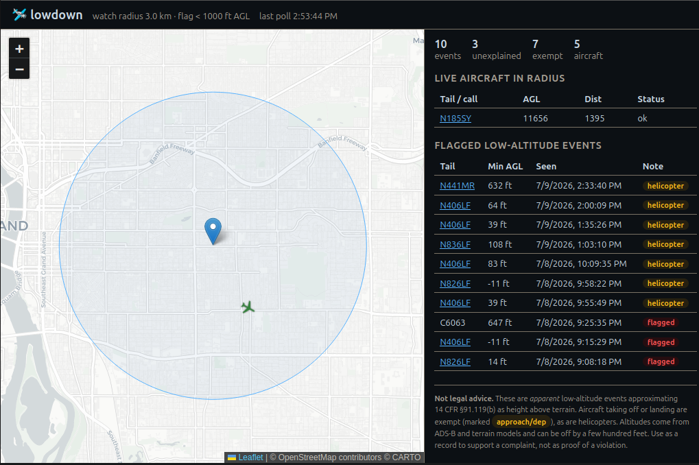

# lowdown 🛩️

Logs and flags **low-flying aircraft** over a target location (an apartment in
Portland, OR by default) and records *apparent* violations of the FAA's minimum
safe-altitude rule so you can build a documented record for a noise complaint.

It polls live ADS-B data from the [OpenSky Network](https://opensky-network.org/),
keeps everything within "earshot" of your location, converts each aircraft's
altitude to **height above terrain (AGL)**, and flags anything below the
threshold — while honestly annotating the cases that are legally exempt.



## What "violation" means here (read this)

The rule is [14 CFR § 91.119](https://www.ecfr.gov/current/title-14/section-91.119).
Over a **congested/urban area** an aircraft must stay **1,000 ft above the
highest obstacle within 2,000 ft** — *not* 1,000 ft above sea level. This tool
approximates that as height above terrain.

Important honesty caveats baked into the app:

- **Takeoff and landing are exempt.** PDX, Troutdale, and Hillsboro are nearby,
  so aircraft on approach/departure legally fly low. Those are **annotated**
  (`likely_approach_departure`), not hidden.
- **Helicopters** have different rules under 91.119(d); rotorcraft are annotated.
- ADS-B altitude + terrain models carry error of a few hundred feet, and we
  can't see individual buildings/obstacles.

So the app produces **apparent low-altitude events**, not legal conclusions.
That's still exactly what the FAA/airport noise office wants: tail number, time,
altitude, and track. To actually report, use the FAA hotline
(1-800-FAA-SURE / 1-866-835-5322) or your airport's noise complaint line.

## Stack

Python 3.12 · [uv](https://docs.astral.sh/uv/) · FastAPI · SQLModel/SQLite ·
httpx · Leaflet · Docker.

## Quick start (local, with uv)

```bash
cp .env.example .env
# edit .env: set LD_APARTMENT_LAT/LON and (recommended) OpenSky credentials

uv sync                 # create venv + install
uv run lowdown serve
# open http://localhost:8000
```

The `serve` command runs the dashboard **and** the collector in one process.
To run them separately:

```bash
uv run lowdown collect   # polling only
uv run lowdown serve     # with LD_RUN_COLLECTOR=false in .env, API only
```

## Quick start (Docker)

```bash
cp .env.example .env      # then edit it
docker compose up --build
# open http://localhost:8000
```

The SQLite database is persisted to `./data`. In dev the port is bound to
`127.0.0.1` only, so the (unauthenticated) app isn't exposed on your LAN.

## Deploy (GHCR + reverse proxy)

The app has **no built-in auth** — put it behind a reverse proxy/auth layer
(e.g. Pangolin/Traefik) and never publish its port to the LAN. The image runs as
a non-root user, ships a healthcheck, and honours `X-Forwarded-*` from the proxy
(`uvicorn --proxy-headers`, with `FORWARDED_ALLOW_IPS=*` because only the proxy
can reach it).

**Publish to GHCR.** Push a tag (or run the *Publish image* workflow) and CI
builds a multi-arch image to `ghcr.io/<owner>/lowdown`:

```bash
git tag v0.1.0 && git push origin v0.1.0
```

To build/push manually from a dev box instead:

```bash
echo "$GHCR_PAT" | docker login ghcr.io -u <owner> --password-stdin
docker buildx build --platform linux/amd64,linux/arm64 \
  -t ghcr.io/<owner>/lowdown:v0.1.0 -t ghcr.io/<owner>/lowdown:latest --push .
```

**Run on the homelab**, attached to your proxy's shared network with **no
published ports** (Pangolin/Traefik routes to `lowdown:8000` internally):

```yaml
services:
  lowdown:
    image: ghcr.io/<owner>/lowdown:latest
    restart: unless-stopped
    env_file: [.env]              # OpenSky creds, LD_APARTMENT_LAT/LON, etc.
    volumes:
      - ./data:/app/data          # chown 1000:1000 ./data  (image runs as UID 1000)
    networks: [pangolin]          # your existing proxy network
    # no `ports:` — the proxy reaches it over the network; add your Pangolin/
    # Traefik routing (labels/resource) here.
networks:
  pangolin:
    external: true
```

Notes:
- **Serve at a subdomain root** (e.g. `lowdown.example.com`), not a subpath —
  the dashboard uses absolute `/api/...` URLs.
- **Seed the FAA registry once** after first start (it lives in the data volume,
  not the image): `docker compose exec lowdown lowdown faa-sync`. Re-run
  periodically as the FAA updates the file.
- Pangolin auth should cover everything; optionally allow `/healthz`
  unauthenticated for external uptime checks.
- The dashboard loads Leaflet + CARTO basemap tiles from public CDNs
  (client-side), so viewers' browsers need outbound internet.

## OpenSky credentials

Anonymous access works but is heavily rate-limited. For reliable data, create a
free account at opensky-network.org, make an **API client**, and set
`LD_OPENSKY_CLIENT_ID` / `LD_OPENSKY_CLIENT_SECRET`. At the default 30 s poll
interval a small bounding box stays within the free daily credit budget.

## Configuration

All settings are environment variables prefixed `LD_` (see
[`.env.example`](.env.example)). The most useful:

| Variable | Default | Meaning |
| --- | --- | --- |
| `LD_APARTMENT_LAT` / `_LON` | downtown PDX | Center of the watch area |
| `LD_EARSHOT_RADIUS_M` | `3000` | Watch radius in meters |
| `LD_THRESHOLD_AGL_FT` | `1000` | Flag aircraft below this AGL |
| `LD_OBSTACLE_BUFFER_FT` | `0` | Pad added to the threshold for buildings |
| `LD_POLL_INTERVAL_S` | `30` | Seconds between OpenSky polls |
| `LD_ELEVATION_PROVIDER` | `open-meteo` | `open-meteo` (per-point terrain) or `fixed` |

## API

- `GET /` — dashboard (map + tables)
- `GET /api/live` — aircraft currently in radius, with AGL and flags
- `GET /api/events` — flagged low-altitude events (`?status=open|closed|all`)
- `GET /api/events/{id}` — one event with its full track (observations)
- `GET /api/tail/{n_number}` — event history for a tail number
- `GET /api/stats` — counts (total, unexplained, approach/departure)
- `GET /healthz` — liveness + last poll time

## How it works

```
OpenSky /states/all (bbox)
      │  every LD_POLL_INTERVAL_S
      ▼
collector ──► filter to radius (haversine) ──► terrain elevation (Open-Meteo, cached)
      │                                              │
      │                                     rules.evaluate() → AGL < threshold?
      ▼                                              │
group consecutive hits per aircraft into  ◄──────────┘
LowAltitudeEvent + Observation rows (SQLite)
      │
      ▼
FastAPI dashboard / JSON API + Leaflet map
```

US tail numbers are derived directly from the ICAO24 address (no lookup needed)
via the deterministic FAA N-number algorithm in
[`nnumber.py`](src/lowdown/nnumber.py).

## Tests & quality gate

```bash
uv sync                       # install dev tools (ruff, mypy, pytest)
uv run python -m pytest       # unit tests
uv run ruff check src tests   # lint
uv run ruff format src tests  # auto-format (drop the args + --check to verify only)
uv run mypy                   # static types
```

CI ([`.github/workflows/ci.yml`](.github/workflows/ci.yml)) runs all of the above
plus a Dockerfile lint (hadolint) and an image build + `/healthz` smoke test on
every pull request. The [publish workflow](.github/workflows/publish-image.yml)
re-validates lint + types + tests before pushing an image to GHCR.

Type checking is a **blocking** gate (mypy). The few SQLModel/SQLAlchemy ORM
expressions mypy can't model (`Column.desc()`, `Model.__table__`) carry targeted
`# type: ignore` comments; `warn_unused_ignores` flags them if a future mypy
learns to understand them.

## Limitations / ideas

- OpenSky coverage of very low aircraft can be spotty; a local RTL-SDR +
  dump1090 feed would catch more. The `opensky.py` client is the only piece
  you'd swap.
- No obstacle/building database — `LD_OBSTACLE_BUFFER_FT` is a blunt stand-in.
- Congested-vs-non-congested is approximated as "everything in the radius is
  urban" (true for central Portland).
